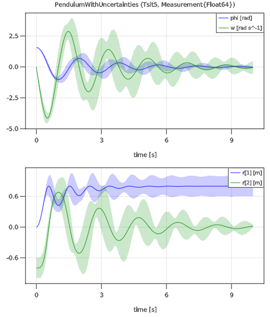

# ModiaSim

[ModiaSim](https://github.com/ModiaSim) consists of a set of Julia packages for modeling and simulation of multidomain engineering systems (electrical, 3D mechanical, fluid, etc.) described by differential equations, algebraic equations, and (space-discretized) partial differential equations. It shares many powerful features of the
[Modelica language](https://www.modelica.org/modelicalanguage), together with new features not available in Modelica. Simulation is performed with [DifferentialEquations.jl](https://github.com/SciML/DifferentialEquations.jl), units are supported via [Unitful.jl](https://github.com/PainterQubits/Unitful.jl) , uncertainty modeling is performed with [Measurements.jl](https://github.com/JuliaPhysics/Measurements.jl), Monte Carlo simulation is performed with [MonteCarloMeasurements.jl](https://github.com/baggepinnen/MonteCarloMeasurements.jl). The following packages are currently available:

| Package                                                  | Description |
|:---------------------------------------------------------|:----------- |
| [ModiaLang.jl](https://github.com/ModiaSim/ModiaLang.jl) | Component- and equation-based modeling of multidomain engineering systems           |
| [ModiaPlot.jl](https://github.com/ModiaSim/ModiaPlot.jl) | Convenient line plots of time series data identified by string keys (using [GLMakie](https://github.com/JuliaPlots/GLMakie.jl)) |
| [ModiaBase.jl](https://github.com/ModiaSim/ModiaBase.jl) | Core algorithms for equation-based modeling                                         |

The following packages are outdated and should not be used (they are currently redesigned):

- [Modia.jl](https://github.com/ModiaSim/Modia.jl),
  [Modia3D.jl](https://github.com/ModiaSim/Modia3D.jl),
  [ModiaMedia.jl](https://github.com/ModiaSim/ModiaMedia.jl),
  [ModiaMath.jl](https://github.com/ModiaSim/ModiaMath.jl)


## Installation

The packages require Julia 1.5 or 1.6. They are registered and can be installed with:

```julia
julia> ]add ModiaBase, ModiaPlot, ModiaLang
```


It is recommended to also add the following packages, in order that all tests and examples can be executed in your standard environment:

```julia
julia> ]add Unitful, DifferentialEquations, Measurements, MonteCarloMeasurements, Distributions
```

## Example

The following differential equations describes a damped pendulum:

```math
\begin{aligned}
 \frac{d\varphi}{dt} &= \omega \\
                   0 &= m \cdot L^2 \cdot \frac{d\omega}{dt} + d \cdot \omega + m \cdot g \cdot L \cdot sin(\varphi) \\
                   r &= \begin{pmatrix}
                           L*cos(\varphi) \\
                          -L*sin(\varphi)
                        \end{pmatrix}
\end{aligned}
```

where ``\varphi`` is the rotation angle, ``\omega`` the angular velocity,
``m`` the mass, ``L`` the rod length, ``d`` a damping constant,
``g`` the gravity constant and ``r`` the vector from the origin of the world system
to the tip of the pendulum. These equations can be defined, simulated and plotted with:

```julia
using ModiaLangModia, Unitful, ModiaPlot
using DifferentialEquations

Pendulum = Model(
   L = 0.8u"m",
   m = 1.0u"kg",
   d = 0.5u"N*m*s/rad",
   g = 9.81u"m/s^2",
   phi = Var(init = 1.57*u"rad"),
   w   = Var(init = 0u"rad/s"),
   r   = Var(start=zeros(2)u"m"),
   equations = :[
          w = der(phi)
        0.0 = m*L^2*der(w) + d*w + m*g*L*sin(phi)
          r = [L*cos(phi), -L*sin(phi)]
   ]
)


pendulum = @instantiateModel(Pendulum)
simulate!(pendulum, Tsit5(), stopTime = 10.0u"s")
plot(pendulum, [("phi", "w"); "r"])
```

The result is the following plot:


Normally distributed uncertainty can be added, simulated and plotted
in the following way:

```julia
using Measurements
PendulumWithUncertainties = Pendulum | Map(L = (0.8 ± 0.2)u"m",
                                           m = (1.0 ± 0.2)u"kg",
                                           d = (0.5 ± 0.2)u"N*m*s/rad")
pendulum2 =  @instantiateModel(PendulumWithUncertainties,
                               FloatType = Measurement{Float64})
simulate!(pendulum2, Tsit5(), stopTime = 10.0u"s")
plot(pendulum2, [("phi", "w"); "r"], figure = 2)
```

resulting in the following plot:



For more details and examples, see the [Tutorial](https://modiasim.github.io/ModiaLang.jl/stable/Tutorial.html).